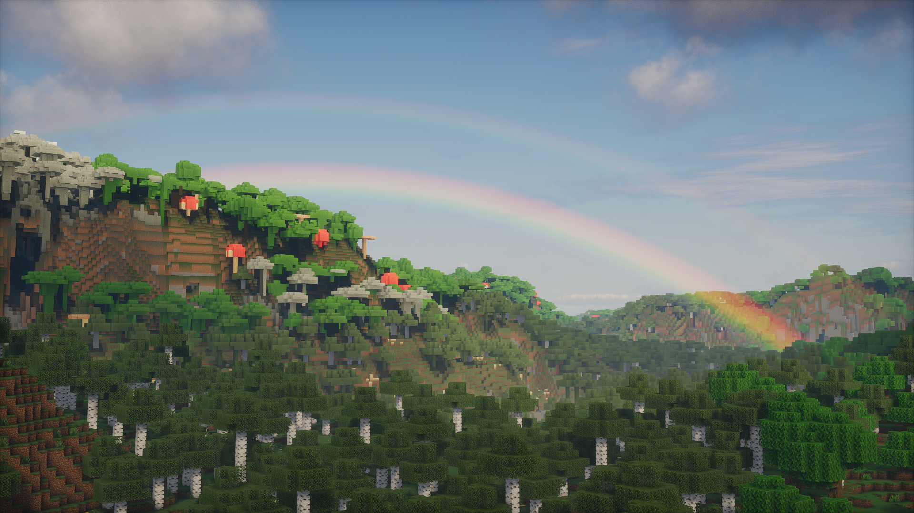

  

<h1 align = "center">Luster</h1>

A gameplay-focused shader pack for Minecraft, forked from <a href="https://github.com/sixthsurge/photon">Photon</a> by SixthSurge — rebuilt for Iris on macOS/OpenGL 4.1 core profile

## About this fork

Luster is a credited fork of Photon Shaders, rebuilt to run well under Apple's OpenGL 4.1 compatibility profile. The sections below detail specific systems in this fork, verified directly against the shader source.

## Mac compatibility

Luster targets Apple's OpenGL 4.1 core profile specifically — the last OpenGL version macOS supports. This profile has no compute shaders and a hard 16-texture-unit sampler budget per shader stage, both meaningfully more restrictive than the OpenGL 4.3+/4.6 environments most shaderpacks (including upstream Photon) assume. Where upstream Photon logic would exceed the sampler budget or lean on compute-shader-only features, this fork reworks the pass to fit within Apple's constraints while preserving the visual result as closely as possible. This is the core reason this fork exists, distinct from any single feature listed below.

## Ambient occlusion (RTAO)

`SHADER_AO` in the settings menu selects between three ambient occlusion methods: `SHADER_AO_SSAO`, `SHADER_AO_GTAO`, and `SHADER_AO_RTAO`. RTAO is a screen-space ray-marched implementation — the ray-marching logic lives in `include/misc/raytracer.glsl` (function `raymarch_depth_buffer`), which intersects view-space rays against the depth buffer with a dither offset, a depth-tolerance check (credited to DrDesten), and a binary-search refinement pass. `RTAO_STEPS` (1–16) and `RTAO_RADIUS` (0.5–10.0) control ray count and reach.

## Image-based lighting (IBL)

`IBL` is a toggleable option with `IBL_SAMPLES` (4–32) controlling sample count and `IBL_INTENSITY` (0.00–2.00) controlling strength. This sits alongside direct sun/moon/block lighting as an ambient contribution term, feeding indirect diffuse lighting from the sky.

## Colored handheld lighting

`HANDHELD_LIGHTING_MODE` has three states: `HANDHELD_LIGHTING_OFF`, `HANDHELD_LIGHTING_NORMAL`, and `HANDHELD_LIGHTING_COLORED`. The colored mode extends held-item light sources (torches, lanterns, etc.) beyond a flat white/warm light to carry actual item-tinted color, with `HANDHELD_LIGHTING_INTENSITY` (0.00–2.00) controlling brightness.

## Moon phase influence

Moon phase affects lighting, atmosphere, and reflections independently, each with its own toggle and strength slider:

* `MOON_PHASE_NIGHT_LIGHTING` + `MOON_PHASE_LIGHTING_STRENGTH` — scales night-time direct lighting contribution by moon phase
* `MOON_PHASE_NIGHT_ATMOSPHERE` + `MOON_PHASE_ATMOSPHERE_STRENGTH` — scales atmospheric/sky brightness by moon phase
* `MOON_PHASE_REFLECTIONS` + `MOON_PHASE_REFLECTIONS_STRENGTH` — scales moonlight's contribution to specular reflections by moon phase

Splitting these three into independently toggleable systems (rather than one blanket moon-phase multiplier) means, for example, moon-phase-driven reflections can be tuned or disabled without affecting ambient night lighting.

## Distant blur

One of two Depth of Field modes, selected via `DOF_MODE`: `DOF_MODE_OFF`, `DOF_MODE_DOF` (true depth of field), or `DOF_MODE_DISTANCE_BLUR`. Distance blur softens geometry past a threshold distance rather than focusing around a focal plane — controlled by `DISTANT_BLUR_INTENSITY` (0.00–1.00) and `DISTANCE_BLUR_START` (1–256 blocks), useful as a cheaper, less DOF-like distance-fade effect.

## Fog smoothing

`FOG_SMOOTHING` with `FOG_SMOOTHING_RADIUS` (0.5–10.0) — smooths transitions in fog density/color, reducing banding or hard edges where fog volume boundaries would otherwise be visually abrupt.

## Everywhere Rain Puddles mode

When it rains rain puddles everywhere not actually a "puddle"

## GUI / settings organization

The settings menu is organized into topic-grouped screens (Materials, Reflections, Lighting, Clouds, Rain, IBL, etc.) rather than one flat option list — this groups the options documented above (RTAO, IBL, handheld lighting, moon phase, DOF/distance blur, fog smoothing) under their relevant categories so they're discoverable without scrolling a single long list. *(Note: exact screen names/groupings are best confirmed in-game via Iris's shader options menu — I've verified the underlying settings exist and are extensive, but haven't independently audited the menu's screen-by-screen layout.)*

## Installation

* Luster is built for [Iris](https://irisshaders.dev/download); OptiFine is not the target platform for this fork
* Once Iris is installed, place the downloaded zip file in your `.minecraft/shaderpacks` folder

### Downloads
* [Latest commit](https://github.com/shashankpgowda/Luster/archive/refs/heads/main.zip)

## Compatibility

### GPU vendors
* Nvidia
* AMD
* Intel
* **Apple Metal (macOS)** — primary target platform for this fork, running through Iris on the OpenGL 4.1 compatibility profile

### Shader loaders
* Iris - version 1.5 and above
* OptiFine is not actively supported by this fork

### Special mod support
* [Distant Horizons](https://www.curseforge.com/minecraft/mc-mods/distant-horizons)
* [Voxy](https://modrinth.com/mod/voxy)

## Acknowledgments

Luster is built on top of Photon Shaders by SixthSurge. All of Photon's original acknowledgments apply to the shared codebase:

* Menu translations:
  * [NakiriRuri](https://github.com/NakiriRuri) and [OrzMiku](https://github.com/Orzmiku) - Chinese Simplified (China; Mandarin)
  * [ChunghwaMC](https://github.com/ChunghwaMC) - Chinese Traditional (Taiwan; Mandarin)
  * [Jmayk](https://github.com/Jmayk-dev) - Italian
  * [Timtaran](https://github.com/Timtaran) - Russian
  * [shihyeon](https://github.com/shihyeon) - Korean
  * [DVRKHz](https://github.com/DVRKHz) - Spanish
  * [Patatagod69](https://github.com/PatataNL) - Dutch
  * sincerity - Estonian
* [Emin](https://github.com/EminGT) - Shadow bias method from [Complementary Reimagined](https://www.complementary.dev/shaders/)
* [DrDesten](https://github.com/DrDesten) - Depth tolerance calculation for SSR/RTAO (credited inline in `raytracer.glsl`)
* [Jessie](https://github.com/Jessie-LC) - f0 and f82 values for labPBR hardcoded metals
* [Sledgehammer Games](https://www.sledgehammergames.com/) - Bloom downsampling method used in Call of Duty Advanced Warfare
* http://momentsingrapics.de/ - Blue noise texture
* [NASA Scientific Visualization Studio](https://svs.gsfc.nasa.gov/4851) - Galaxy image

## Community

This is a personal fork maintained by [shashankpgowda](https://github.com/shashankpgowda). For questions or issues specific to this fork, please open an issue on this repository.

For the original Photon Shaders project, see [sixthsurge/photon](https://github.com/sixthsurge/photon) and their [Discord server](https://discord.gg/ngEW66HScd).
